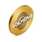
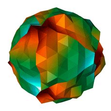
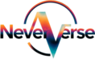

# 🌌 Solnova Ecosystem

In this raging world, in this vortex of madness and absurdity spinning out of control, right in its center—frozen and immovable—without warning or preparation, **SHE** was born and exploded into myriads of stars: the **Solnova Universe**.

If you are reading this, it means you are present at this very moment. You are the consciousness within which this cosmos arises. You are its future body, its Alpha and Omega. You are its Supreme Meme.

## Solnova (SNOVA) Token 

Solnova is not just another meaningless coin, not just another one-day meme coin clogging the ether with nothing but a bright wrapper.

**Solnova is a desperate attempt to find a stronghold of calm and harmony in the heart of reigning chaos.**

It is a place where, in the silent rotation of celestial spheres, consciousness finds peace, and the crypto investor holding it finds a high-yield asset and a loyal community. A place where the only law is the physics of rotation, attraction, and repulsion, and everything else is allowed and welcomed—because the cosmos has seen it all and accepts it all as it is.

> [!INFO]
> **Solnova is a space of creativity, shining and dispelling the darkness.**

Why is this so? What exactly does this mean and how is it realized? You will find out very soon.

## Neververse NFT Collection 

Neververse is the Solnova Universe. It is the space we have hinted at so unequivocally. It is our personal cosmos where everyone who is lucky enough to purchase or receive our NFT for free finds themselves.

**Each NFT is a unique, inimitable Star.**

Planets revolve around each such star. There are many of them, but not all are visible because the light of the star does not reach everyone. The brighter the star shines, the more planets revolving around it become visible.

## Neververse Utility 

Neververse is a real-time 3D social platform where you own a Star System, navigate with your Ship, and interact with other users and brands in a shared universe. It's a creative space where GIFs and memes become collectibles, a game where helping others boosts your rewards, and a marketplace where creators sell Skins and Brands run campaigns. Neververse bridges Web 3.0 ownership with Web 2.0 engagement—you own your Star (NFT), customize your Planets, collect rare GIFs, and earn SNOVA through farming, creativity, and social interaction. It's a living cosmos where every action creates value, every connection matters, and brands participate alongside users in an evolving digital economy.
