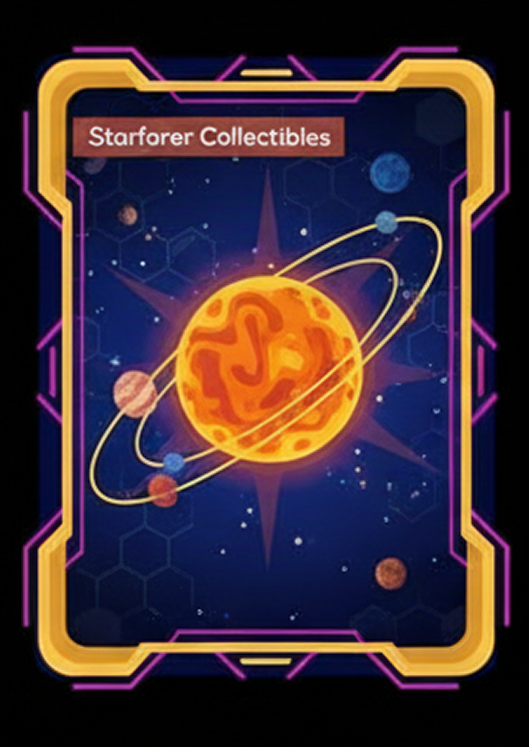

# 🎯 NFT Functions & Properties

The Neververse NFT is your passport to the Solnova Universe. It is not just a collectible; it is a productive asset, a piece of digital real estate, and a key to gameplay.

Example of the NFT Card design showcasing the visual representation of a Neververse Star NFT.

<h2>NFT Functions & Utility</h2>

Owning a Solnova NFT grants you:
1.  **Ownership of a Star System:** You get a Star and a set of Planets orbiting it.
2.  **SNOVA Farming:** Your Star generates SNOVA tokens over time.
3.  **Gameplay Access:** Participate in the ecosystem, customize your planets, and interact with others.
4.  **Brand Interaction (Season 4):** Rent out your planets to brands for rewards.

## Star Properties

Each Star NFT is minted with specific initial parameters that define its gameplay potential.

### 1. Initial Brightness
*   **Range:** 10% - 30% (Random).
*   **Maximum:** 100%.
*   **Effect:** Brightness determines how many planets are visible (unlocked) and affects the SNOVA farming rate.

### 2. Initial Stars
*   The number of already opened planets from the very beginning.
*   **Dependency:** Depends on Initial Brightness (Minimum 1).

### 3. Max Planets
*   The total number of planets that will be opened around this star when Brightness reaches 100%.
*   **Dependency:** Rarity.

| Rarity | Max Planets | Minimum Planets |
| :--- | :--- | :--- |
| Common | Up to 6 | 2 |
| Uncommon | Up to 8 | 4 |
| Rare | Up to 12 | 6 |
| Epic | Up to 16 | 8 |
| Legendary | Up to 24 | 10 |

### 4. Initial Size
*   The physical size of the Star in the Neververse.
*   **Dependency:** Rarity. Legendary stars are significantly larger (up to 2.5x average size) than Common ones.

### 5. Farming Coefficients
*   **Default Farming Capacity:** Base SNOVA generation per hour per planet.
*   **Farming Coefficient:** A multiplier based on Star Rarity.
*   **Planet Farming Coefficient:** A multiplier specific to each planet (Boosted x2 by Satellites).

<strong>Full Brightness Boost:</strong> Reaching 100% brightness gives a <strong>x2 Multiplier</strong> to the Farming Coefficient for the Star and all its planets.

### 6. Coordinate & Color
*   **Color:** Random color from the range corresponding to the NFT Rarity.
*   **Coordinate:** The actual physical address in the Neververse.
    *   **Rule:** Stars are distributed evenly from the center to the periphery.
    *   **Evolution:** Older stars (Genesis) remain closer to the Galaxy Center. New stars from later seasons appear on the expanding borders.

