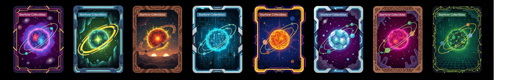

# ⭐ NFT Types & Rarity

The Neververse is populated by stars of different magnitudes. The rarity of your NFT determines the potential of your Star System.

Visual representation of different Star Types and their glows.

| NFT Rarity | Probability | Star Type ID |
| :--- | :--- | :--- |
| **Common** | 64% | 12 |
| **Uncommon** | 25% | 8 |
| **Rare** | 10% | 6 |
| **Epic** | 9% | 3 |
| **Legendary** | 1% | 3 |

*   **StarType** defines the rarity and visual characteristics of the NFT.
*   **Visual Components:** The art is generatively created from various components (StarType, CardType, OuterBG, InnerBG).

Examples of the Neververse NFTs showcasing the diverse visual styles and rarity levels across the collection.

